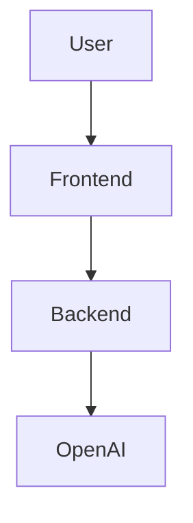

# 🏗️ Architecture Overview

## System Diagram

```
[ User ]
   |
   v
[ React Frontend (Vite, MUI) ]
   |
   v
[ FastAPI Backend ]
   |
   v
[ OpenAI API ]
```

- **Frontend**: React app (Vite, MUI) for prompt input, data preview, filtering, and download.
- **Backend**: FastAPI server exposes `/generate-data` endpoint, relays prompt to OpenAI, formats response.
- **OpenAI**: Generates synthetic data based on user prompt.

---

## API Documentation

### POST `/generate-data`
Generate synthetic data from a natural language prompt.

**Request Body:**
```json
{
  "prompt": "Generate 50 fake customer profiles with fields: name, email, age, country",
  "format": "json" // or "csv"
}
```

**Response:**
- If `format` is `json`:
  ```json
  { "json": [ { ... }, ... ] }
  ```
- If `format` is `csv`:
  ```json
  { "csv": "col1,col2\nval1,val2..." }
  ```

**Errors:**
- `{ "error": "<error message>" }`

---

## Usage Example

**Request:**
```bash
curl -X POST http://localhost:8000/generate-data \
  -H "Content-Type: application/json" \
  -d '{"prompt": "Generate 10 users with name and email", "format": "json"}'
```

**Response:**
```json
{
  "json": [
    { "name": "Alice", "email": "alice@example.com" },
    { "name": "Bob", "email": "bob@example.com" }
  ]
}
```

---

## Frontend Data Flow
1. User enters prompt and selects format.
2. Frontend sends POST to `/generate-data`.
3. Shows loading spinner, then displays data in table.
4. User can filter, sort, and download data.

---

## Extending the App
- Add more endpoints in FastAPI for advanced data types.
- Add authentication for API usage.
- Add more export formats (Excel, Parquet, etc).
- Add user accounts and saved datasets.

---

## Diagrams
You can add diagrams using [diagrams.net](https://diagrams.net/) or [Mermaid](https://mermaid-js.github.io/). Example:


