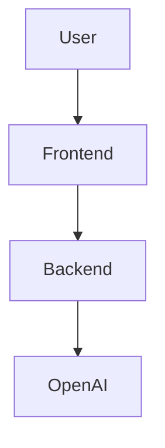

# Architecture Overview

## System Diagram



- **Frontend**: React app (Vite, MUI) for prompt input, data preview, filtering, and download.
- **Backend**: FastAPI server with `/health` and `/generate-data` endpoints. Uses OpenAI structured output with a JSON schema to guarantee well-formed responses. Includes rate limiting (slowapi) and structured logging.
- **OpenAI**: Generates synthetic tabular data based on user prompts using structured output mode.

---

## API Endpoints

### `GET /health`

Health check for monitoring and container orchestration.

**Response:** `200 OK`
```json
{ "status": "ok" }
```

### `POST /generate-data`

Generate synthetic data from a natural language prompt. Rate limited to 10 requests/minute per IP.

**Request Body:**
```json
{
  "prompt": "Generate 50 fake customer profiles with fields: name, email, age, country",
  "format": "json"
}
```

- `prompt` (string, required, min length 1)
- `format` (`"json"` or `"csv"`, default `"json"`)

**Response (JSON format):**
```json
{ "json": [ { "name": "Alice", "email": "alice@example.com" }, ... ] }
```

**Response (CSV format):**
```json
{ "csv": "name,email\nAlice,alice@example.com\n..." }
```

**Error Responses:**

| Status | Detail |
|--------|--------|
| 422    | Validation error (empty prompt, invalid format) |
| 429    | Rate limit exceeded |
| 502    | OpenAI API error, malformed response, or invalid data |

---

## Backend Architecture

```
main.py
├── Configuration (env vars, OpenAI client, logging)
├── Middleware (CORS, SlowAPI rate limiter)
├── Schemas (DataRequest pydantic model, DATASET_SCHEMA for structured output)
├── Routes
│   ├── GET  /health
│   └── POST /generate-data
└── Helpers
    ├── request_dataset_from_openai()  — calls OpenAI with structured output schema
    └── extract_json()                 — parses response, unwraps {"rows": [...]}, validates row structure
```

**Key design decisions:**
- Uses OpenAI structured output (`response_format` with `json_schema`) to enforce the `{"rows": [...]}` shape, reducing parsing failures.
- `extract_json()` still handles fallback regex extraction for robustness.
- Rate limiting via slowapi protects against API key abuse.
- All errors are raised as `HTTPException` with appropriate status codes.

---

## Frontend Data Flow

1. User enters a prompt (or clicks a sample chip / random prompt).
2. Frontend checks the client-side cache; if hit, displays immediately.
3. On cache miss, sends `POST /generate-data` to the backend.
4. Shows loading spinner during the request.
5. Response is normalized: JSON arrays pass through directly; CSV strings are parsed via PapaParse into row objects.
6. Data is displayed in a MUI DataGrid with per-column search filters (contains, starts with, regex).
7. User can sort, paginate, filter, and download the data.
8. Prompt is saved to localStorage history (max 10 entries).

---

## Extending the App

- Add authentication for API usage.
- Add more export formats (Excel, Parquet).
- Add user accounts and saved datasets.
- Add streaming responses for large datasets.
- Add data validation rules in the prompt (e.g., "emails must be unique").
